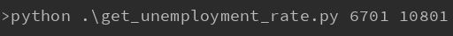

# get_unemployment_rate

Open in terminal
keyin >>

python .\get_unemployment_rate 起始年月 結束年月

起始年月格式: 民國X年X月
         Ex: 10001(民國100年1月)
結束年月格式: 民國X年X月
         Ex: 10001(民國100年1月)
         
         
         
         
Export:
list[]
total mounth:

         
